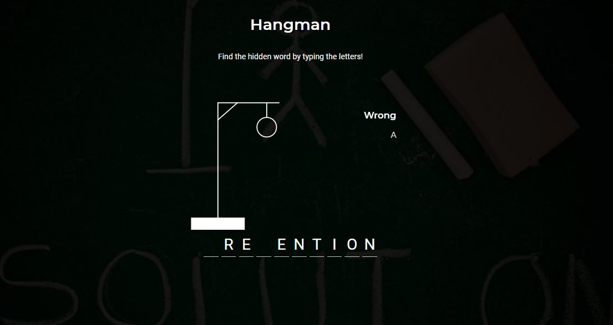

## hangman game  :100:

This hangman game is made with vanilla JavaScript, no framework or library. To play the game, visit [https://sam0132nodier.github.io/hangman-javascript](https://sam0132nodier.github.io/hangman-javascript) and _select a letter to figure out the hidden word in few amount of chances._

## Game specifications

- Display the hangman using SVG.
- Generate a random word.
- Display the word in User Interface with correct letters.
- Display the wrong letters.
- Show bottom notification when attempt to select the letter twice.
- Show an awesome popup on __win__ or __lose__.
- Provide an option to play again the game and start the whole process from the top.

## Contributions

Please view `CONTRIBUTE.md` for information related to how to contribute to this project.

Thanks for your time.
